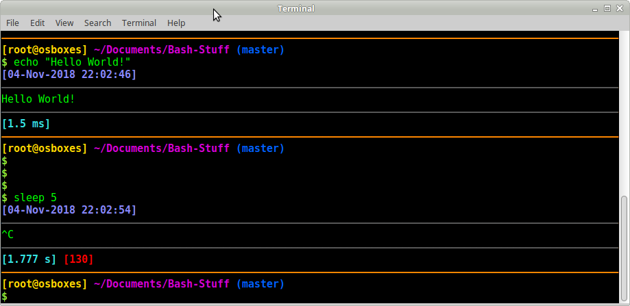

# Bash-Stuff
A collection of handy files to soup up your bash terminal experience (especially the prompt!)

.bash_aliases and .bash_functions are a useful collection of aliases and functions. To use these, source the respective files in your .bashrc, or add them to your own files as necessary.

.bash_prompt contains a prompt set-up for the BASH terminal. The colours were designed for green-text-on-black. You can change the colours by modifying the values in this file accordingly.

.bashrc was simply the bashrc file I had on my computer I wrote this on, to facilate transporting it around on multiple computers for myself. If you do not wish to use this, simply source the necessary files above in your own .bashrc.
